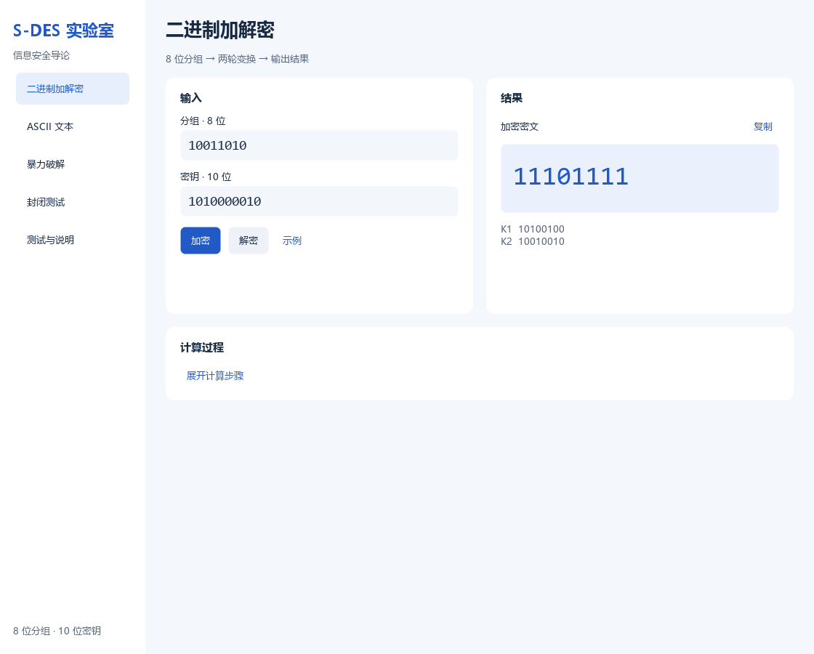

# S-DES 实验室

信息安全导论课程作业的 Python 窗口程序，包含二进制加解密、ASCII 文本、暴力破解、密钥碰撞分析和 CSV 交叉验证。

## 实验内容

| 关卡 | 实验内容 |
|---|---|
| 第1关：基本测试 | 8 位分组加解密、10 位密钥输入及中间状态验证 |
| 第2关：交叉测试 | 与另一小组的测试向量比较加密结果并验证解密恢复 |
| 第3关：ASCII 扩展 | ASCII 文本加解密及二进制、十六进制、Base64 转换 |
| 第4关：暴力破解 | 枚举全部 1024 个密钥，输出候选集合及计算耗时 |
| 第5关：封闭测试 | 统计全部明文、密钥组合的密文分布与密钥碰撞 |

## 启动

使用 **Python 3.13+**，在项目根目录执行：

```powershell
python -m pip install -r requirements.txt
python -m sdes_app
```

依赖为 PySide6 6.11.1；实验环境为 Windows 11、Python 3.13.5 / 3.13.7。[虚拟环境与操作指南](docs/user-guide.md)。

## 预览



算法采用作业参数，轮密钥累计左移 **1、2 位**，存在等效密钥；破解返回全部候选。默认示例：`10011010` + 密钥 `1010000010` → `11101111`。

## 验证与文档

- 自动测试：`python -m unittest discover -v`
- [五关测试报告](docs/test-report.md)
- [用户指南](docs/user-guide.md) · [开发手册](docs/developer-guide.md)
- [实验材料索引](docs/evidence/README.md) · [界面设计说明](docs/ui-design.md)

项目材料包括源代码、五关测试报告、用户指南、开发手册、CSV 实验数据、程序截图和演示录像。

## 小组成员

方裕涵  20241352
王楷睿  20240164
