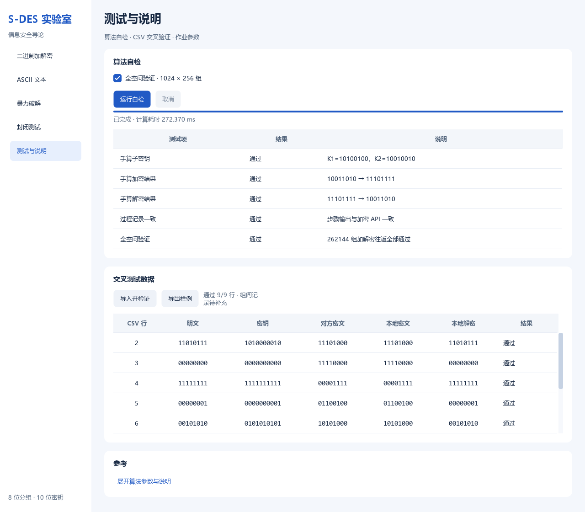
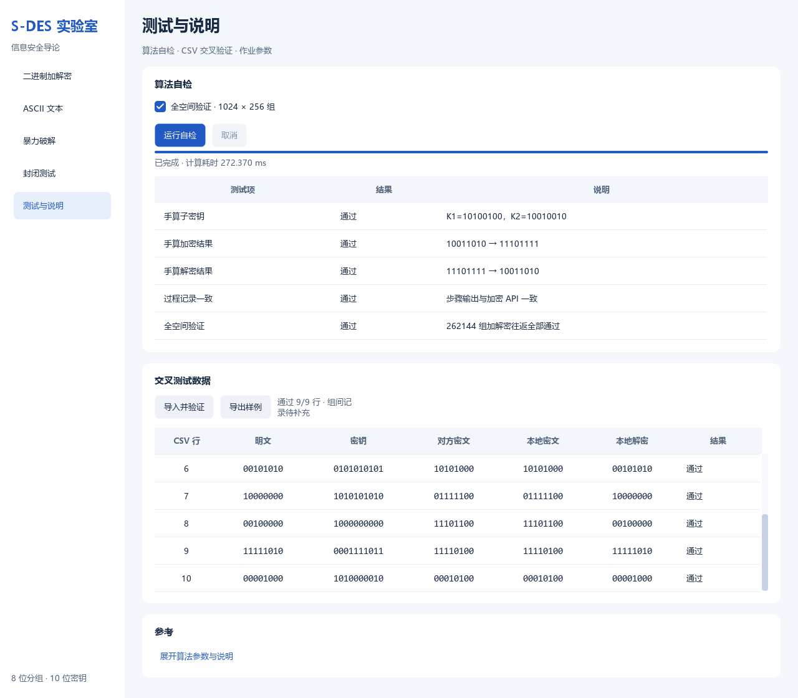
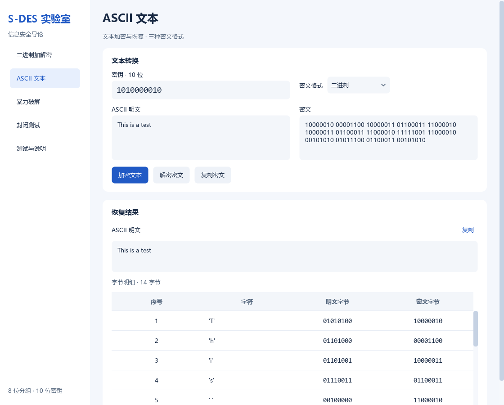
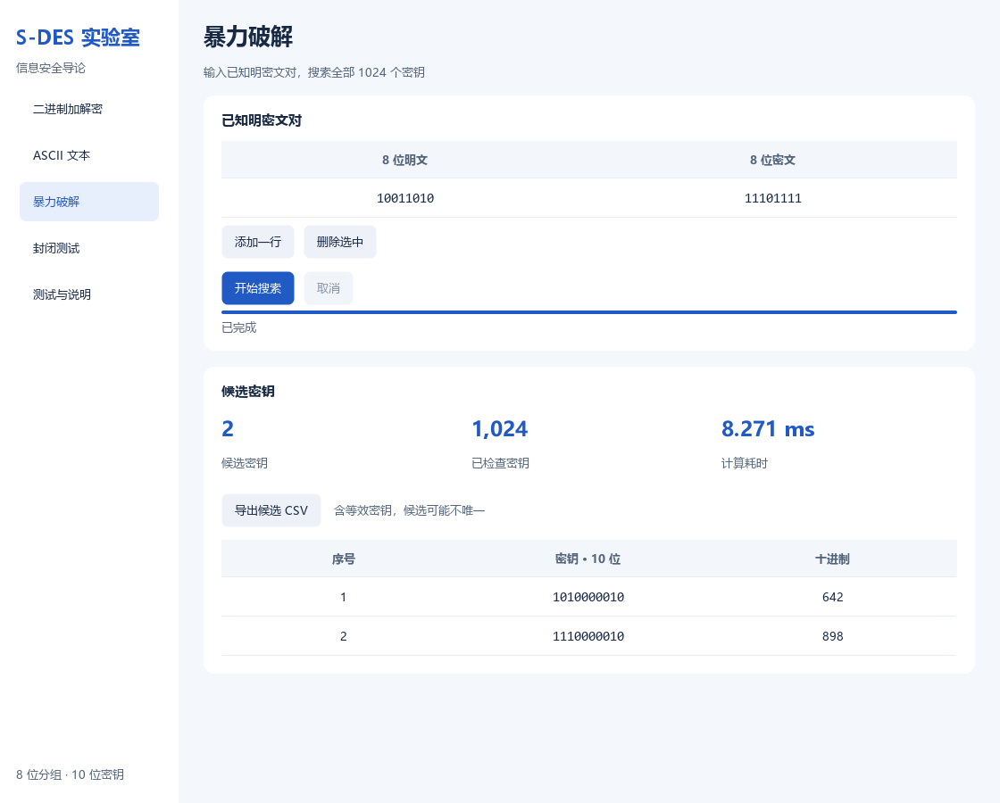
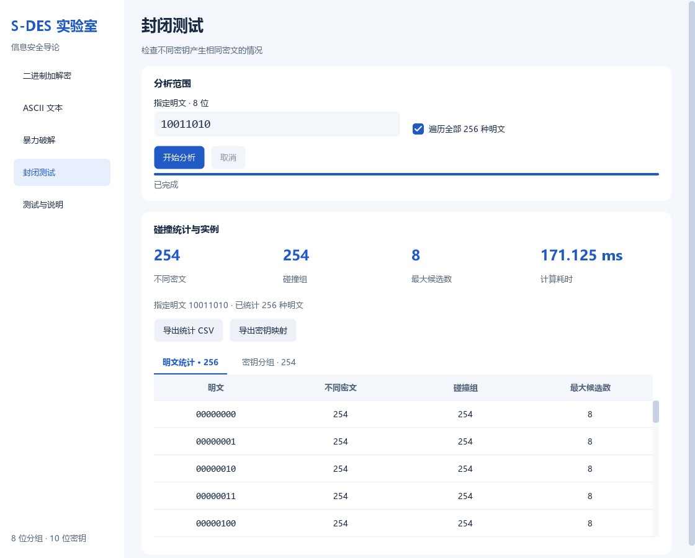

# 信息安全课程作业1：S-DES 算法实现与五关测试报告

本实验实现 8 位分组、10 位密钥的 S-DES 算法及图形界面，完成基本加解密、组间交叉测试、ASCII 扩展、暴力破解和密钥碰撞分析五项实验。算法采用课程题面给定参数，子密钥按 P10 后累计循环左移 1、2 位生成。

测试采用手算向量、独立参考实现、全空间枚举、组间数据对照和图形界面操作，记录运算结果、候选密钥、碰撞统计及计算耗时。

## 实验环境与测试方法

| 项目 | 内容 |
|---|---|
| 操作系统 | Windows 11（10.0.26100） |
| Python | 脚本测试 3.13.5，应用运行 3.13.7 |
| 图形界面 | PySide6 / Qt 6.11.1 |
| 处理器 | AMD64 Family 25 Model 117 Stepping 2 |
| 程序版本 | S-DES 实验室 1.2.0 |
| 实验日期 | 2026-10-03、2026-10-07 |

自动测试共 35 项，失败 0 项、错误 0 项，总耗时 9.787339 秒。核心全空间验证覆盖全部 1024 个密钥与 256 个分组，共 262144 组加解密往返；独立字符串实现完成 8192 组对照，覆盖全部主密钥及 8 种代表性明文。

界面验证覆盖按钮、键盘输入、导航、复制、格式转换、后台任务、取消、异常处理、CSV 交换及中文显示，并检查 1120 × 900、880 × 600 窗口和 150% / 200% 缩放。截图直接取自实际 Qt 控件。算法计算耗时以对应运行记录为准，不包含界面加载反馈。

原始记录见[测试日志](evidence/results/unittest.txt)和[环境与实验汇总](evidence/results/summary.json)，界面设计见[界面说明](ui-design.md)。

## 第1关：基本测试

采用课程题面参数，P10 后左右两半累计循环左移 1、2 位。使用手算向量核对轮密钥、置换、轮函数及最终结果。

| 项目 | 位串 |
|---|---|
| 明文 / 主密钥 | `10011010` / `1010000010` |
| P10 | `1000001100` |
| 累计移位 1 / K1 | `0000111000` / `10100100` |
| 累计移位 2 / K2 | `0001010001` / `10010010` |
| IP | `00011011` |
| 第一轮 EP / XOR | `11010111` / `01110011` |
| 第一轮 S-Box / P4 / fK | `0011` / `0110` / `01111011` |
| SW | `10110111` |
| 第二轮 EP / XOR | `10111110` / `00101100` |
| 第二轮 S-Box / P4 / fK | `0001` / `0100` / `11110111` |
| 最终密文 | `11101111` |
| 解密恢复 | `10011010` |

自动测试逐项核对上述中间状态，并检查全零、全一、前导零及无效输入。全部 262144 组加解密往返一致，每个密钥下的 256 个密文均不同。基本测试通过。

## 第2关：交叉测试

采用另一小组提供的测试向量，原始数据见 [peer-vectors-original.csv](evidence/cross-test/peer-vectors-original.csv)。文件包含 9 条向量、9 种明文和 8 个密钥，覆盖全零、全一、交替位串及前导零。对每行明文和密钥计算本组密文，与对方密文比较；同时直接解密对方密文，与该行明文比较。

原始文件表头为 `key,plaintext,ciphertext`，导入文件 [peer-vectors-import.csv](evidence/cross-test/peer-vectors-import.csv) 按接口要求排列为 `plaintext,key,ciphertext`。两份文件的位串、前导零及数据行顺序一致。

| 检查项目 | 实测结果 |
|---|---|
| 格式合法 | 9/9 |
| 本组加密与对方密文一致 | 9/9 |
| 本组解密对方密文并恢复明文 | 9/9 |
| 加密、解密同时通过 | 9/9，100% |
| 独立字符串参考实现复核 | 9/9 一致 |
| 实际 Qt 界面导入 | 显示“通过 9/9 行”，全部结果为“通过” |

9 条向量的加密和解密结果均一致，交叉测试通过。原始数据、逐行结果与复现方法见[交叉测试记录](cross-test-record.md)，机器可读结果见[验证结果 CSV](evidence/cross-test/cross-test-results.csv)和[验证汇总 JSON](evidence/cross-test/cross-test-summary.json)。

以下两张完整程序窗口截图的分辨率为 1280 × 1120，结果表覆盖 CSV 第 2～10 行，第 6 行为重叠行。

## 第3关：ASCII 扩展

| 项目 | 实测内容 |
|---|---|
| 明文 | `This is a test` |
| 密钥 | `1010000010` |
| 十六进制密文 | `82 0C 83 63 C2 83 63 C2 F9 C2 2A 5C 63 2A` |
| Base64 密文 | `ggyDY8KDY8L5wipcYyo=` |
| 恢复结果 | `This is a test` |

测试覆盖空文本、空格、制表符、换行、NUL、DEL、全部 128 种 ASCII 字符及全部 256 字节在三种密文格式中的无损转换。文本解密恢复一致，格式转换保持字节内容，非 ASCII 输入及不合法格式均返回明确错误。ASCII 扩展测试通过。

## 第4关：暴力破解

使用密钥 `1010000010` 生成已知对：依次追加明文 `10011010`、`01010101`、`00000000`、`11111111`；对应密文为 `11101111`、`00000101`、`01101010`、`10001110`。每次均完整枚举 1024 个密钥。

| 运行方式 | 明密文对数量 | 已检查密钥数 | 候选数 | 计算耗时 / ms |
|---|---|---|---|---|
| 脚本测试 | 1 | 1024 | 2 | 0.710800 |
| 脚本测试 | 2 | 1024 | 2 | 0.661800 |
| 脚本测试 | 3 | 1024 | 2 | 0.655700 |
| 脚本测试 | 4 | 1024 | 2 | 0.666300 |
| 界面操作 | 1 | 1024 | 2 | 9.609 |
| 界面操作 | 2 | 1024 | 2 | 1.361 |

全部运行均得到候选 `1010000010`（642）与 `1110000010`（898）。多组已知对的候选集合为各单组候选集合的交集；矛盾数据 `(0,0)`、`(0,1)` 无候选。后台计算使用 QThread 保持窗口响应，取消状态与异常恢复按任务状态显示。

该规则存在等效密钥：原始第 2 位经 P10 到位置 3，累计移位 1、2 位后分别到位置 2、1，均被 P8 排除。因此 `K` 和 `K xor 0100000000` 生成相同的两个轮密钥。全部 1024 个主密钥对应 512 对不同子密钥；样例中的两个候选在全部 256 种明文上等效。

[实验录像](evidence/video/bruteforce.mp4)记录单组已知对搜索、增加第二组已知对及再次搜索的操作过程，时长约 28 秒，分辨率为 1408 × 1032。[候选结果 CSV](evidence/results/key_candidates.csv)对应界面第二次搜索，两行均为 `completed=True`、`checked=1024`、`elapsed_seconds=0.001361000`。录像、CSV 与候选集合一致，暴力破解测试通过。输入与操作步骤见[暴力破解实验记录](demo-recording.md)。

## 第5关：封闭测试 / 密钥碰撞

固定明文遍历全部 1024 个密钥，按密文分组统计碰撞；再对全部 256 种明文重复实验，共执行 262144 次加密，计算耗时为 0.146785600 秒。

| 指定明文 `10011010` 的指标 | 实测值 |
|---|---|
| 已检查密钥 | 1024 |
| 不同密文数 | 254 |
| 含多个密钥的碰撞组数 | 254 |
| 最大候选密钥数 | 8 |
| 密文 `11101111` 的候选 | `1010000010`、`1110000010` |

全部 256 种明文各自产生 254 种不同密文，最大候选密钥数均为 8。每个指定明文的分组总计覆盖全部 1024 个密钥，密钥不重复；样例密文分组与暴力破解候选一致。

固定明文时，1024 个密钥映射到最多 256 种密文，由鸽巢原理必有碰撞。具体明密文对的候选数量随输入变化。碰撞统计覆盖完整密钥空间，封闭测试通过。

原始数据：[256 明文统计](evidence/results/collision-statistics.csv)、[指定明文的 1024 条映射](evidence/results/collision-mapping-10011010.csv)。

[密钥分组页签](evidence/screenshots/09-key-groups.png) 单独展示指定明文的候选列表，表格滚动不影响表头。

## 实验结论

| 关卡 | 验证内容与主要结果 | 结论 |
|---|---|---|
| 第1关：基本测试 | 手算中间状态一致，262144 组加解密往返通过 | 通过 |
| 第2关：交叉测试 | 另一小组提供的 9 条数据，加密与解密均 9/9 一致 | 通过 |
| 第3关：ASCII 扩展 | 文本加解密恢复一致，128 种 ASCII 字符及三种密文格式验证通过 | 通过 |
| 第4关：暴力破解 | 完整枚举 1024 个密钥，录屏与 CSV 保存候选及计算耗时 | 通过 |
| 第5关：封闭测试 | 完成 256 种明文与 1024 个密钥的碰撞统计，样例不同密文数为 254 | 通过 |

五项实验均通过。S-DES 实现满足分组加解密、组间数据一致性、ASCII 扩展、全密钥枚举与碰撞统计要求。累计移位 1、2 位的规则产生等效密钥，破解结果完整保留满足约束的候选集合。源代码、实验数据、截图、录像及使用说明见[项目实验材料索引](evidence/README.md)。
