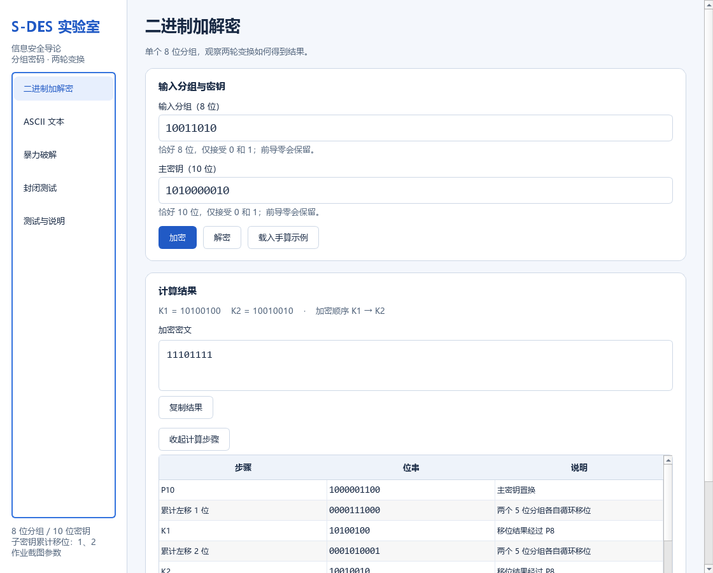
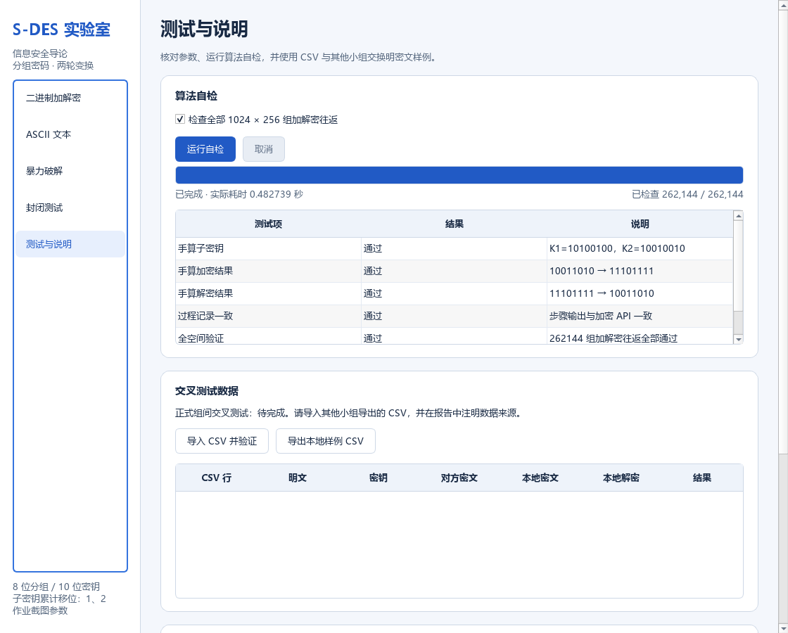
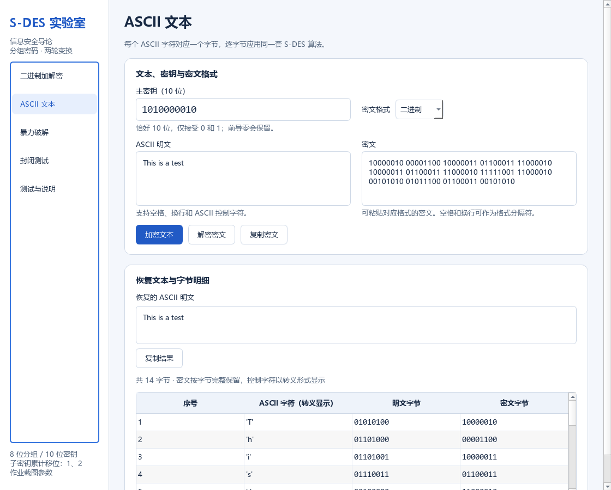
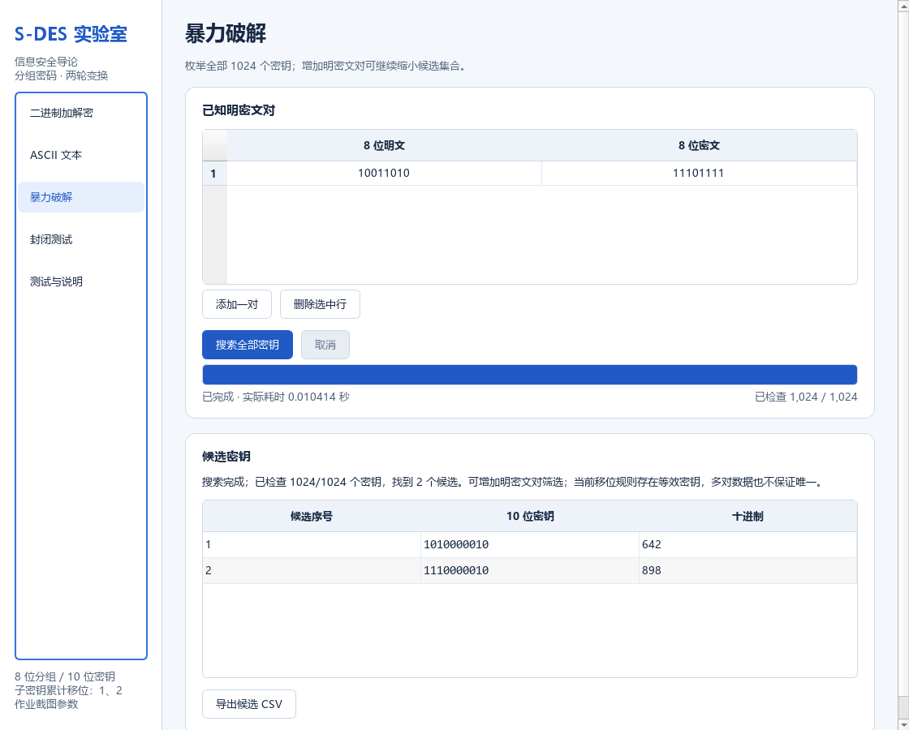
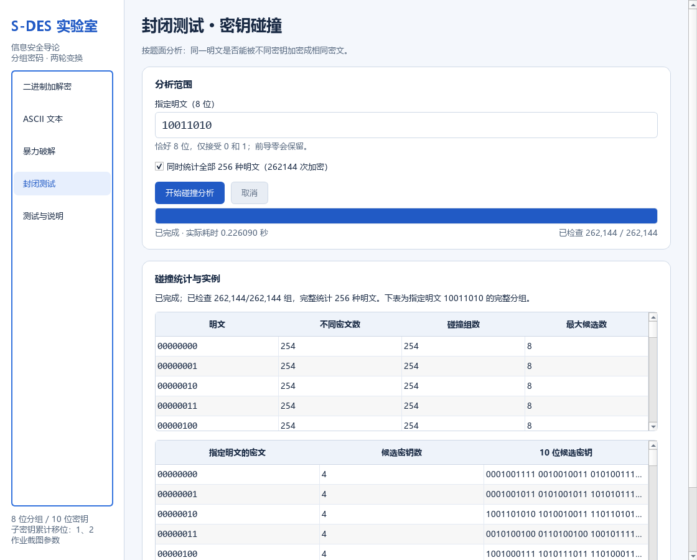

# 五关测试报告

本报告由 `tools/verify_project.py` 根据实际执行结果生成。记录时间：2026-10-03T13:02:16.882911+08:00（UTC+8）。截图来自实际 Qt 离屏渲染，另一个进程中的耗时可能不同。

## 环境与总体验证

- 系统：Windows-11-10.0.26100-SP0。
- Python：3.13.5；PySide6 / Qt：6.11.1。
- 处理器信息：AMD64 Family 25 Model 117 Stepping 2, AuthenticAMD。
- 自动测试：28 项，失败 0，错误 0，本次执行 3.220285 秒。
- 核心全空间：262144 组加解密往返全部通过，每个密钥下 256 个密文均不同。
- 独立字符串实现：8192 组对照全部通过，覆盖全部主密钥及 8 种代表性明文；它不引用产品的位运算或参数常量。
- Qt 验证：按钮、Enter、导航、复制、格式转换、后台任务完成 / 异常 / 取消、运行中关闭、CSV 导入导出和中文字体。两个尺寸的截图为 1120 × 900、880 × 600。

原始证据：[测试日志](test-results/unittest.txt)、[完整汇总 JSON](test-results/summary.json)。界面检查为程序化 Qt 交互和截图检查，未声称在其他操作系统或辅助技术中完成验证。

## 第1关：基本测试

采用作业截图参数和确认后的累计左移 1、2 位规则。独立手算用例：

| 项目 | 位串 |
|---|---|
| 明文 / 主密钥 | `10011010` / `1010000010` |
| P10 | `1000001100` |
| 累计移位 1 / K1 | `0000111000` / `10100100` |
| 累计移位 2 / K2 | `0001010001` / `10010010` |
| IP | `00011011` |
| 第一轮 EP / XOR | `11010111` / `01110011` |
| 第一轮 S-Box / P4 / fK | `0011` / `0110` / `01111011` |
| SW | `10110111` |
| 第二轮 EP / XOR | `10111110` / `00101100` |
| 第二轮 S-Box / P4 / fK | `0001` / `0100` / `11110111` |
| 最终密文 | `11101111` |
| 解密恢复 | `10011010` |

自动测试逐项断言以上中间状态，并检查全零、全一、前导零及无效输入。通过。

## 第2关：交叉测试

**正式组间交叉测试待完成。** 未取得另一小组的程序或真实数据，不将本地文件回读视为组间测试。

已经实现固定列 CSV 的导入、导出、加密对照、解密对照和逐行错误说明；本地 8 条样例往返验证通过。可用 [本地样例 CSV](test-results/local-vectors.csv) 与其他小组交换，实际结果填写 [交叉记录模板](cross-test-record.md)。

## 第3关：ASCII 扩展

| 项目 | 实测内容 |
|---|---|
| 明文 | `This is a test` |
| 密钥 | `1010000010` |
| 十六进制密文 | `82 0C 83 63 C2 83 63 C2 F9 C2 2A 5C 63 2A` |
| Base64 密文 | `ggyDY8KDY8L5wipcYyo=` |
| 恢复结果 | `This is a test` |

测试包括空文本、空格、制表符、换行、NUL、DEL、全部 128 种 ASCII 字符及全部 256 字节在三种密文格式中的无损转换。非 ASCII 输入和不合法格式得到明确错误，不采用忽略错误字节的解码方式。通过。

## 第4关：暴力破解

使用密钥 `1010000010` 生成已知对：依次追加明文 `10011010`、`01010101`、`00000000`、`11111111`；对应密文为 `11101111`、`00000101`、`01101010`、`10001110`。每次均完整枚举 1024 个密钥。

| 明密文对数量 | 候选数 | 全部候选密钥 | 实际计算秒数 |
|---|---|---|---|
| 1 | 2 | 1010000010、1110000010 | 0.000675300 |
| 2 | 2 | 1010000010、1110000010 | 0.000653600 |
| 3 | 2 | 1010000010、1110000010 | 0.000646100 |
| 4 | 2 | 1010000010、1110000010 | 0.000642300 |

本地进程完成测试、缓存预热后的一次实测，包含搜索循环，不含界面启动；不代表性能保证。 QThread 的工作是保持窗口响应，本项目没有声称线程提高 CPU 并行速度。多对筛选测试验证候选为单对集合的交集；矛盾数据 `(0,0)`、`(0,1)` 无候选。取消后明确标为未完成，异常后可以重试。功能和本地自动测试通过。

该规则存在等效密钥：原始第 2 位经 P10 到位置 3，累计移位 1、2 位后分别到位置 2、1，均被 P8 排除。因此 `K` 和 `K xor 0100000000` 生成完全相同的两个轮密钥。本次穷举确认只有 512 对不同子密钥；样例中的两个候选在全部 256 种明文上完全等效，更多已知对也无法区分。

**真实桌面录像待录制。** 已提供 [录像操作步骤](demo-recording.md)，没有用截图或人为延时冒充演示录像。

## 第5关：封闭测试 / 密钥碰撞

按题面研究固定明文下不同密钥能否产生相同密文。实际执行 262144 次加密，完整统计 256 种明文，本次耗时 0.140773400 秒。

| 指定明文 `10011010` 的指标 | 实测值 |
|---|---|
| 已检查密钥 | 1024 |
| 不同密文数 | 254 |
| 含多个密钥的碰撞组数 | 254 |
| 最大候选密钥数 | 8 |
| 密文 `11101111` 的候选 | `1010000010`、`1110000010` |

全部明文的不同密文数范围为 254～254，最大候选数范围为 8～8。每个指定明文的分组总计覆盖全部 1024 个密钥，密钥不重复；样例密文分组与暴力破解候选完全一致。

固定明文时，1024 个密钥映射到最多 256 种密文，由鸽巢原理必有碰撞。本次结果并不意味着每个明密文对都具有相同候选数量。通过。

原始数据：[256 明文统计](test-results/collision-statistics.csv)、[指定明文的 1024 条映射](test-results/collision-mapping-10011010.csv)。

## 提交前待补材料

填写真实小组成员与分工；完成另一小组参与的第2关记录；按步骤录制第4关视频或动图；检查仓库文件和启动说明，然后按课程要求提交链接。当前没有上传、push 或提交课程材料。
